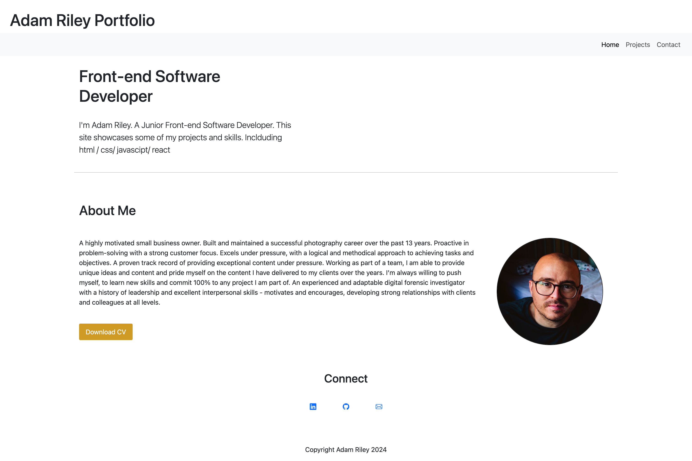
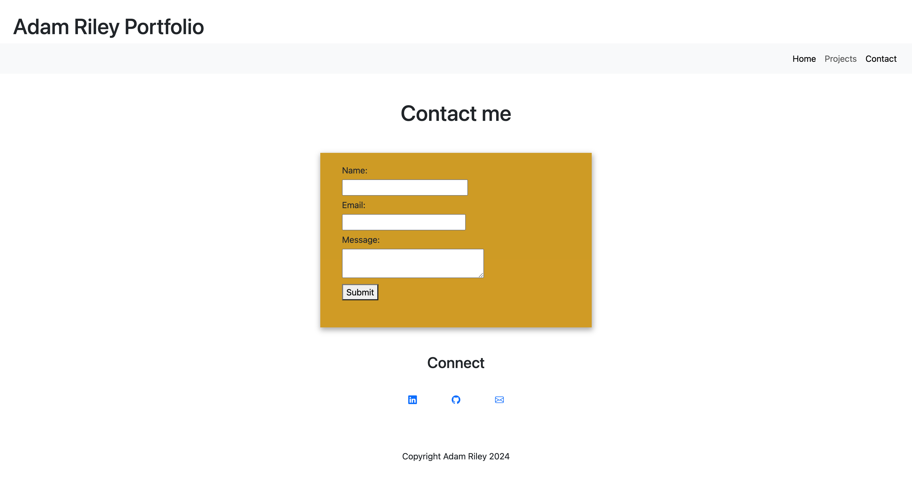
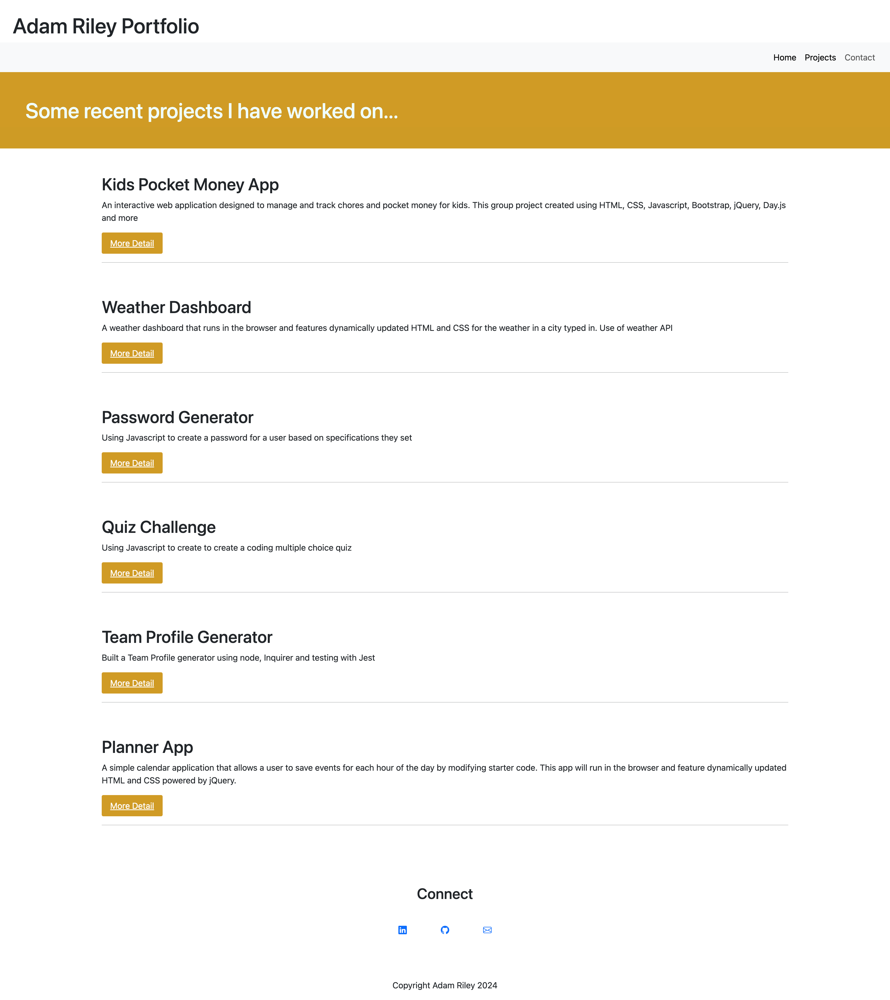
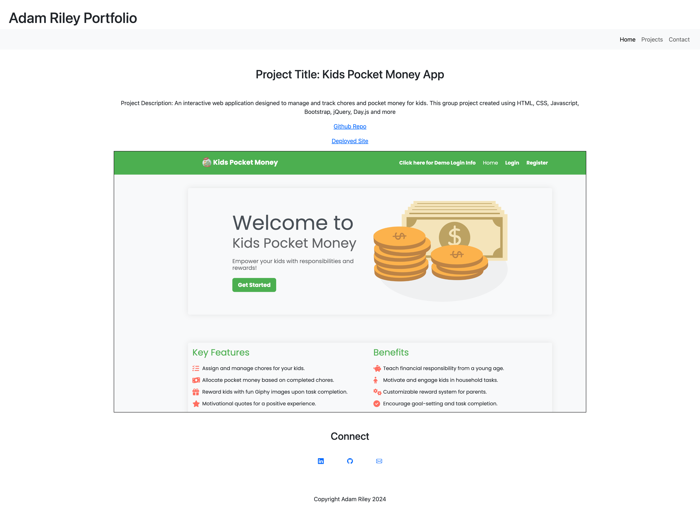

# react-portfolio

Portfolio for Adam Riley created using React

Description
This is a website for to showcase the work of Adam Riley - Software Dewveloper. Created using react with vite, routes, bootstrap and custom css. Features a contact page with form and a downloadable CV.

7 main components:

1. [ ] App
2. [ ] Header
3. [ ] Footer
4. [ ] Home
5. [ ] Project Gallery
6. [ ] Project
7. [ ] ProjectMore
8. [ ] Contact

Screenshot:

Installation
N/A

Usage
Website for visitors to understand more about Adam Riley's skillset, get in contact and download CV

Application Link:

Credits
N/A

License
MIT License

Copyright (c) [2024] [Adam Riley]

Permission is hereby granted, free of charge, to any person obtaining a copy of this software and associated documentation files (the "Software"), to deal in the Software without restriction, including without limitation the rights to use, copy, modify, merge, publish, distribute, sublicense, and/or sell copies of the Software, and to permit persons to whom the Software is furnished to do so, subject to the following conditions:

The above copyright notice and this permission notice shall be included in all copies or substantial portions of the Software.

THE SOFTWARE IS PROVIDED "AS IS", WITHOUT WARRANTY OF ANY KIND, EXPRESS OR IMPLIED, INCLUDING BUT NOT LIMITED TO THE WARRANTIES OF MERCHANTABILITY, FITNESS FOR A PARTICULAR PURPOSE AND NONINFRINGEMENT. IN NO EVENT SHALL THE AUTHORS OR COPYRIGHT HOLDERS BE LIABLE FOR ANY CLAIM, DAMAGES OR OTHER LIABILITY, WHETHER IN AN ACTION OF CONTRACT, TORT OR OTHERWISE, ARISING FROM, OUT OF OR IN CONNECTION WITH THE SOFTWARE OR THE USE OR OTHER DEALINGS IN THE SOFTWARE.
